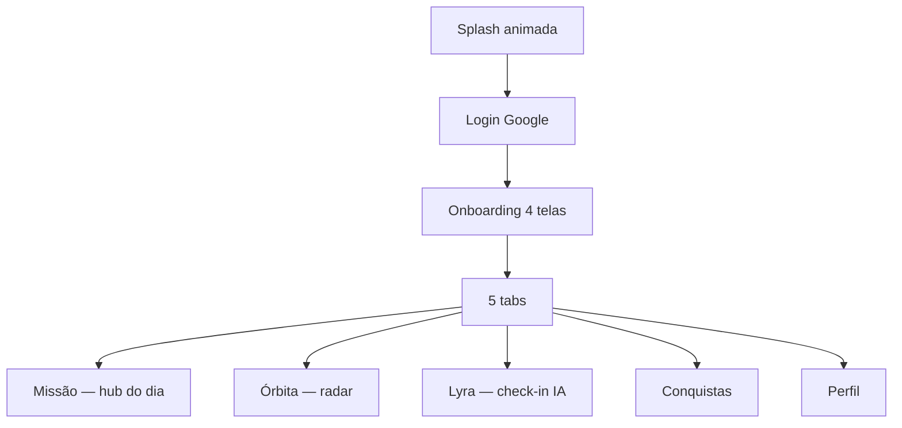

# 🪐 Orbita

[](https://reactnative.dev/)
[](https://expo.dev/)
[](https://supabase.io/)
[](https://openai.com/)
[](https://opensource.org/licenses/MIT)

**Seu centro de comando emocional**, um app mobile que ajuda você a equilibrar cinco dimensões da vida (Descanso, Energia, Ritmo, Nutrição e Bem-estar) com a **Lyra**, a inteligência da nave acessível por voz e texto.

> 🏆 **Global Solution FIAP 2026 · Indústria Espacial**
> Este projeto foi desenvolvido como proposta de solução para os desafios de saúde mental e performance em situações de isolamento prolongado (no espaço ou na Terra).
>

## 🚀 O que é o Orbita?

A **Órbita** é um espaço dedicado ao bem-estar emocional. Cada **tripulante** representa uma dimensão importante da sua vida. Juntos, desenvolvem consciência, equilíbrio e qualidade de vida.

A **Lyra** acompanha sua trajetória, registra progressos e oferece suporte personalizado durante a **missão** do dia, da conversa ao insight, da análise de padrões às micro-tarefas sugeridas.

### Proposta de valor

> _Toda jornada precisa de uma tripulação. A Órbita traduz seu momento em clareza, direção e continuidade, sem culpa, sem gamificação punitiva._

### 🤖 Como a Lyra funciona

| Etapa | O que a Lyra faz |
|-------|------------------|
| **Conversa** | Check-in guiado por voz ou texto nas 5 dimensões |
| **Compreensão** | OpenAI (servidor) interpreta respostas e contexto |
| **Scores** | Atualiza o radar da órbita por área |
| **Insights** | Gera recomendações personalizadas por pilar |
| **Tarefas** | Sugere micro-ações do dia na Missão |
| **Padrões** | Histórico e evolução ao longo do tempo |

> A chave da OpenAI **nunca** fica no celular, só na Edge Function `lyra-chat` (Supabase).

---

## 📱 Demonstração


## 🛠️ Stack técnica

| Camada | Tecnologia |
|--------|------------|
| **App** | React Native 0.85 · Expo 56 · TypeScript |
| **UI** | Tamagui · tema dark · glass morphism |
| **Tipografia** | Space Grotesk (títulos) · Inter (corpo) |
| **Navegação** | React Navigation — tabs + stacks |
| **Auth** | Firebase Auth + Google Sign-In |
| **Dados** | Supabase (Postgres + RLS) |
| **IA** | Supabase Edge Function `lyra-chat` → OpenAI |
| **Voz** | OpenAI TTS + `expo-audio` / `expo-speech` |
| **Build** | EAS Build · dev client nativo |

⚠️ **Importante:** Não utilize o **Expo Go**. Recursos como login com Google, pager do onboarding e manipulação avançada de áudio exigem **dev build** (`npm run ios` / `npm run android` ou instalação do APK via EAS).

---

## 🗺️ Jornada do usuário



### Onboarding (4 passos)

1. **Toda jornada precisa de uma tripulação** — proposta de valor + logo mark  
2. **Sua tripulação** — radar das 5 dimensões  
3. **Lyra, a inteligência da nave** — papel da coach de IA  
4. **Conecte-se à sua tripulação** — nome, foco opcional, termos → **Siga viagem**

### Loop diário

```
Manhã     → Missão (estado + CTA)
Check-in  → Lyra (voz ou texto)
Feedback  → Missão / Órbita (scores + insight)
Rotina    → Tarefas do dia + conquistas
```

### Papéis das tabs

| Tab | Papel |
|-----|-------|
| **Missão** | Painel do dia — saudação, estado da órbita, tarefas |
| **Órbita** | Radar e detalhe por dimensão (scores, gráfico 7d, recomendação Lyra) |
| **Lyra** | Ação principal — conversa, check-in estruturado ou livre |
| **Conquistas** | Marcos da jornada |
| **Perfil** | Conta, Lyra, permissões, área de testes |

Documentação viva: [`docs/USER_JOURNEY.md`](docs/USER_JOURNEY.md)

---

## 🚀 Guia de instalação
Escolha o caminho de acordo com seu objetivo:

| Objetivo | Caminho |
|----------|---------|
| Só testar (sem clonar) | [Caminho A — APK EAS](#caminho-a--só-testar-apk) |
| Dev no simulador/emulador | [Caminho B — Dev local](#caminho-b--desenvolver-localmente) |
| Deploy backend / novo build | [Caminho C — Mantenedor](#caminho-c--mantenedor) |
| Apresentação para o time | [`docs/APRESENTACAO_EQUIPE.md`](docs/APRESENTACAO_EQUIPE.md) |

---

## 📲 Caminho A — Só testar (APK)

1. Baixe o APK preview mais recente:  
   **https://github.com/eritonLongui/Orbita---react-native/releases/tag/preview-fb2127fd**  
   (alternativa: [builds EAS](https://expo.dev/accounts/marcomendessv/projects/Orbita/builds))
2. Instale no celular Android.
3. Toque em **Continuar com Google**.

O APK de **preview** é assinado com o certificado EAS cadastrado no Firebase — **login Google funciona para qualquer pessoa** que instalar esse APK, sem configurar SHA-1 no notebook dela.

**iOS (simulador no Mac):** `npm run setup:ios` → `npm start` + `npm run ios`  
**iOS (iPhone físico):** build EAS `preview` ou conta Apple Developer.

---

## 💻 Caminho B — Desenvolver localmente

### Pré-requisitos

| Plataforma | O que instalar |
|------------|----------------|
| **Todos** | Node.js **20+**, npm, Git |
| **iOS (Mac)** | Xcode + Simulador iOS + CocoaPods (`sudo gem install cocoapods`) |
| **Android** | Android Studio + SDK + emulador Android |

### Setup automático (recomendado)

```bash
git clone https://github.com/eritonLongui/Orbita---react-native.git
cd Orbita---react-native

npm run setup              # deps + valida backend
npm run setup:ios          # primeira vez no Mac: gera pasta ios/
# ou: npm run setup:android   # primeira vez: gera pasta android/
# ou: npm run setup:all       # ambos
```

### Rodar
Abra dois terminais na raiz do projeto:

**Terminal I:**

```bash
npm start
```

**Terminal II:**

```bash
npm run ios       # Simulador iOS (Mac)
# ou:
npm run android   # Emulador Android
```

### Notas 

- **Sem `.env` obrigatório** — chaves públicas em [`src/config/publicEnv.ts`](src/config/publicEnv.ts).
- **Não use Expo Go** — use dev client (`npm run ios` / `android`).
- **Android dev local:** cada máquina pode precisar cadastrar SHA-1 no Firebase → [`docs/GOOGLE_LOGIN.md`](docs/GOOGLE_LOGIN.md).
- **iOS simulador:** costuma funcionar para todo o time após `setup:ios`.
- **Preview de telas:** Perfil → Área de testes → Login / Onboarding.

### Só validar ambiente

```bash
npm run setup:check
```

---

## Caminho C — Mantenedor

### Backend (Lyra na nuvem)

Copie [`.env.example`](.env.example) → `.env` (gitignored, só na sua máquina):

```env
SUPABASE_ACCESS_TOKEN=sbp_...
SUPABASE_PROJECT_REF=yifgbmrpnpljjrmjwwfq
OPENAI_API_KEY=sk-...
```

```bash
npm run deploy:supabase
npm run validate:supabase
```

### Gerar APK / IPA para testadores

```bash
npm run build:preview:android          # APK (qualquer Android)
npm run build:preview:ios-simulator    # Simulador iOS (Mac)
```

Ou interativo:

```bash
npm run build:preview
```

Cadastre o **SHA-1 do build EAS** no Firebase (uma vez) — veja [`docs/PRODUCTION.md`](docs/PRODUCTION.md).

## 📚 Documentação

### Guias do Projeto:
| Arquivo | Conteúdo |
|---------|----------|
| [`docs/APRESENTACAO_EQUIPE.md`](docs/APRESENTACAO_EQUIPE.md) | Roteiro para apresentação do projeto |
| [`docs/APRESENTACAO_EQUIPE.md`](docs/APRESENTACAO_EQUIPE.md) | Roteiro para apresentação do time |
| [`docs/USER_JOURNEY.md`](docs/USER_JOURNEY.md) | Jornada, narrativa e backlog UX |
| [`docs/GOOGLE_LOGIN.md`](docs/GOOGLE_LOGIN.md) | Login Google e `DEVELOPER_ERROR` |
| [`docs/PRODUCTION.md`](docs/PRODUCTION.md) | Distribuição, EAS e usuários finais |
| [`docs/SECRETS.md`](docs/SECRETS.md) | Variáveis de ambiente |

### Principais Scripts npm:
| Comando | Descrição |
|---------|-----------|
| `npm run setup` | Instala deps + valida arquivos e Supabase |
| `npm run setup:ios` | Setup + `expo prebuild` iOS |
| `npm run setup:android` | Setup + `expo prebuild` Android |
| `npm run setup:all` | Setup + prebuild iOS e Android |
| `npm run setup:check` | Só checagens, sem instalar |
| `npm start` | Metro bundler (dev client) |
| `npm run ios` | Build + run simulador iOS |
| `npm run android` | Build + run emulador Android |
| `npm run validate:supabase` | Testa API e `lyra-chat` |
| `npm run build:preview:android` | APK EAS para testadores |
| `npm run build:preview:ios-simulator` | Build iOS simulador (EAS) |
| `npm run auth:fingerprints` | SHA-1 local (dev Android) |
| `npm run reset:native` | Regenera `ios/` e `android/` |
---

## 📂 Estrutura do projeto

```
src/
  screens/       # auth, onboarding, mission, orbit, lyra, achievements, profile
  components/    # UI, Lyra, órbita, missão, navegação
  services/      # Firebase, Supabase, conversa, tarefas, jornada
  hooks/         # Lyra, órbita, conquistas, missão
  constants/     # tema, copy, pilares, tipografia
  config/        # publicEnv.ts
supabase/
  migrations/    # Schema Postgres
  functions/     # lyra-chat (Edge Function)
scripts/         # setup.sh, deploy, validação, run-ios
assets/          # ícones, logos, login-planet.png
```

---

## Licença
 
Distribuído sob a licença MIT. Veja [`LICENSE`](LICENSE) para mais detalhes.
