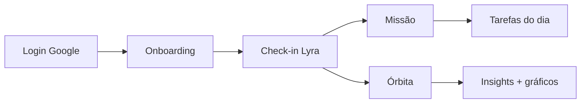

# Orbita — Roteiro para apresentação

Documento para o time montar slides, demo ao vivo ou pitch. Complementa o [`README.md`](../README.md).

---

## 1. Elevator pitch (30 segundos)

**Orbita** é um app de bem-estar emocional que usa a metáfora de uma **missão espacial**: você tem uma **tripulação** (cinco dimensões da vida) e a **Lyra**, inteligência da nave, como coach de IA.

Ela conversa com você por **voz ou texto**, entende seu momento, atualiza sua **órbita** visual, gera **insights** e sugere **tarefas do dia** — tudo em português, com tom calmo e sem culpa.

**Frase de valor:** *Toda jornada precisa de uma tripulação.*

---

## 2. Problema que resolvemos

| Dor | Como a Órbita responde |
|-----|------------------------|
| Apps de saúde são frios ou punitivos | Tom de coach, sem streaks agressivos |
| Difícil enxergar equilíbrio entre áreas da vida | Radar com 5 dimensões visíveis |
| Falta de continuidade entre “meditar hoje” e “o que fazer amanhã” | Missão diária + histórico + tarefas |
| IA genérica sem contexto pessoal | Lyra conhece check-ins anteriores e foco do usuário |

---

## 3. Proposta de valor (para slide)

### Para o usuário

- **Clareza** — vê onde está forte e onde oscila (Descanso, Energia, Ritmo, Nutrição, Bem-estar)
- **Direção** — recomendações e micro-tarefas práticas para hoje
- **Continuidade** — check-in diário leve, evolução ao longo do tempo
- **Acolhimento** — Lyra escuta antes de prescrever

### Para o projeto / FIAP

- Stack moderna e demonstrável (React Native + IA em produção)
- Arquitetura segura (OpenAI só no servidor)
- Login real (Google) e backend real (Supabase)
- UX narrativa coerente (tripulação, missão, órbita)

---

## 4. Metáfora e vocabulário (use nos slides)

| Termo | Significado no app |
|-------|-------------------|
| **Órbita** | Espaço / app de bem-estar emocional |
| **Tripulação** | As 5 dimensões da vida (cada uma é um “tripulante”) |
| **Tripulante** | Descanso · Energia · Ritmo · Nutrição · Bem-estar |
| **Lyra** | Inteligência da nave — coach de IA (voz + texto) |
| **Missão** | O dia da jornada — painel com estado e próximos passos |
| **Check-in** | Ritual de conversa guiada com a Lyra |
| **Conquistas** | Marcos de uso e progresso |

**Tagline do login:** *SEU CENTRO DE COMANDO EMOCIONAL*

---

## 5. Fluxo completo para demonstração (roteiro demo)

Sugestão de ordem para mostrar o app em ~5–8 minutos:

### A. Entrada

1. **Splash** — animação orbital (marca emocional)
2. **Login** — tela com planeta, partículas, logo; **Continuar com Google**
3. **Onboarding** (4 telas, swipe ou botão):
   - *Toda jornada precisa de uma tripulação*
   - *Sua tripulação* — radar das 5 dimensões
   - *Lyra, a inteligência da nave*
   - *Conecte-se à sua tripulação* — nome + foco → **Siga viagem**

### B. Primeiro uso (tabs)

4. App abre na **Lyra** (primeira vez) ou **Missão** (retorno)
5. **Lyra — check-in**
   - Modo voz ou texto
   - Lyra pergunta área por área (Descanso → … → Bem-estar)
   - Ao completar: scores e insight alimentam o resto do app

### C. Feedback visual

6. **Missão** — saudação, estado da órbita, tarefas do dia (geradas/sugeridas)
7. **Órbita** — radar + cards expandíveis por dimensão:
   - Score atual
   - Estado (excelente / equilíbrio / oscilando / atenção)
   - Gráfico últimos 7 dias
   - Recomendação da Lyra

### D. Engajamento

8. **Conquistas** — badges desbloqueáveis
9. **Perfil** — preferências da Lyra (tom de voz), permissões, conta



---

## 6. Onde a IA entra (diferencial — slide dedicado)

Este é o **coração técnico e de produto** da apresentação.

### Pipeline da Lyra

```
Usuário (voz/texto/imagem)
        ↓
   App React Native
        ↓ JWT Firebase
   Supabase Edge Function  lyra-chat
        ↓
   OpenAI (GPT + TTS)
        ↓
   Resposta + JSON estruturado (check-in)
        ↓
   App atualiza: scores · insights · tarefas · histórico
```

### O que a IA faz em cada etapa

| Etapa | IA | Resultado no app |
|-------|-----|------------------|
| **Conversa livre** | Responde com empatia e orientação prática | Chat na Lyra |
| **Check-in estruturado** | Conduz 5 áreas em ordem; devolve JSON | Progresso do ritual |
| **Análise do momento** | Interpreta respostas e contexto | Scores por dimensão |
| **Insights** | Texto personalizado por área | Card “Recomendação da Lyra” na Órbita |
| **Padrões** | Histórico de scores (7 dias+) | Gráficos de evolução |
| **Tarefas** | Micro-ações derivadas do check-in | Lista na Missão |
| **Voz** | OpenAI TTS com estilos (calmo, neutro, etc.) | Lyra fala as respostas |

### Por que isso é diferencial

1. **Não é chatbot solto** — IA ligada a um modelo de bem-estar (5 dimensões + missão diária)
2. **Não é formulário estático** — conversa natural, voz ou texto
3. **Fecha o loop** — conversa → dado → visualização → ação → reforço no dia seguinte
4. **Seguro** — `OPENAI_API_KEY` só no Supabase; usuário autenticado via Firebase
5. **Escalável** — Edge Function independente do app store

### Frases prontas para o slide de IA

- *“A Lyra não só responde — ela estrutura o check-in, extrai sinais e devolve o que importa hoje.”*
- *“Cada conversa pode atualizar sua órbita, gerar um insight e uma tarefa concreta.”*
- *“A inteligência roda na nuvem; o celular só conversa e exibe.”*

---

## 7. As cinco dimensões (slide de produto)

| Dimensão | O que representa |
|----------|------------------|
| **Descanso** | Sono, regularidade e recuperação |
| **Energia** | Atividade física e vitalidade |
| **Ritmo** | Rotina, consistência e pausas |
| **Nutrição** | Alimentação e hidratação |
| **Bem-estar** | Lazer, descanso mental e hobby |

No radar: equilíbrio = forma estável; oscilação = deformação (espelho gentil, não punição).

---

## 8. Arquitetura (slide técnico opcional)

```
┌─────────────────────────────────────┐
│  App (Expo / React Native)          │
│  Firebase Auth · Google Sign-In     │
│  Tamagui UI · Reanimated · Moti    │
└──────────────┬──────────────────────┘
               │ HTTPS + JWT
┌──────────────▼──────────────────────┐
│  Supabase                           │
│  Postgres + RLS (dados por usuário) │
│  Edge Function lyra-chat              │
│  Secret: OPENAI_API_KEY             │
└──────────────┬──────────────────────┘
               │
┌──────────────▼──────────────────────┐
│  OpenAI API                         │
└─────────────────────────────────────┘
```

**Stack em uma linha:** Expo 56 · React Native · Tamagui · Firebase · Supabase · OpenAI

---

## 9. Como testar (para colegas na apresentação)

### Opção A — APK (mais fácil, qualquer Android)

1. Baixar APK preview: **https://github.com/eritonLongui/Orbita---react-native/releases/tag/preview-0da53e3f**  
   (alternativa: [builds EAS](https://expo.dev/accounts/marcomendessv/projects/Orbita/builds))  
2. Instalar no celular Android  
3. Login Google → **Continuar com Google**  

✅ Funciona para **qualquer pessoa** (certificado EAS já no Firebase)

### Opção B — Simulador (dev)

```bash
npm run setup:ios      # Mac + Xcode
npm start              # terminal 1
npm run ios            # terminal 2
```

Android emulador:

```bash
npm run setup:android
npm start
npm run android
```

⚠️ **Não usar Expo Go**  
⚠️ Android dev local pode exigir SHA-1 no Firebase por máquina — ver [`GOOGLE_LOGIN.md`](GOOGLE_LOGIN.md)

---

## 10. Roteiro sugerido de slides (10–12 telas)

| # | Slide | Conteúdo |
|---|-------|----------|
| 1 | Capa | Orbita — Seu centro de comando emocional |
| 2 | Problema | Bem-estar fragmentado, apps punitivos |
| 3 | Solução | Tripulação + Lyra + missão diária |
| 4 | Metáfora | Diagrama órbita / 5 tripulantes |
| 5 | Demo fluxo | Login → onboarding → Lyra → missão |
| 6 | Lyra / IA | Pipeline conversa → insight → tarefa |
| 7 | Órbita | Radar + gráficos + recomendações |
| 8 | Missão | Hub do dia + tarefas |
| 9 | Diferencial | IA integrada, não chatbot isolado |
| 10 | Tech | Stack + segurança (OpenAI no servidor) |
| 11 | Demo ao vivo | Roteiro seção 5 |
| 12 | Próximos passos | Notificações, evolução longa, lojas |

---

## 11. Perguntas frequentes (Q&A)

**A Lyra substitui psicólogo/médico?**  
Não. Copy e termos deixam claro: apoio de rotina, não substitui profissional.

**Os dados são privados?**  
Sim — RLS no Supabase: cada usuário só acessa seus dados. Auth via Firebase.

**Por que Google login?**  
Identidade única, rápida para demo e produção; integra com Firebase/Supabase JWT.

**Funciona offline?**  
Parcial — UI local; Lyra exige internet (Edge Function).

**Quanto custa a IA?**  
OpenAI cobrado no projeto Supabase; usuário final não configura chave.

---

## 12. Assets visuais sugeridos

- Logo mark: `assets/images/orbita-logo-mark.png`
- Wordmark: `assets/images/orbita-logo-wordmark.png`
- Login: `assets/images/login-planet.png`
- Screenshots: simulador — login, onboarding, Lyra, órbita expandida, missão

**Preview interno:** Perfil → Área de testes → Abrir login / Abrir onboarding

---

## 13. Contatos e links

| Recurso | URL |
|---------|-----|
| Builds EAS (APK) | https://expo.dev/accounts/marcomendessv/projects/Orbita/builds |
| Firebase | projeto `orbita-fiap` |
| Supabase | `yifgbmrpnpljjrmjwwfq` |
| Repo | GitHub do time |

---

*Última atualização: junho 2026 — alinhado ao fluxo onboarding 4 telas, tab Conquistas, narrativa tripulação.*
