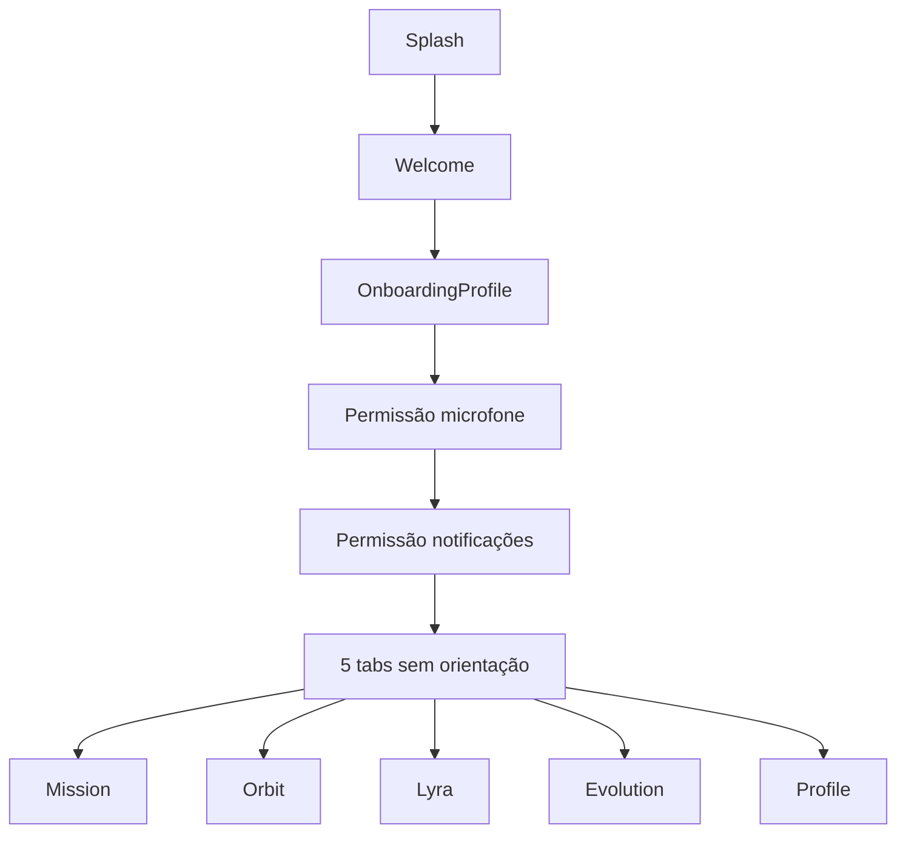
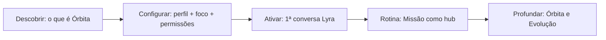

# Jornada do usuário — Orbita

Documento de referência para produto, design e desenvolvimento. Complementa a skill do agente em `.cursor/skills/orbita-journey/SKILL.md`.

---

## 1. Problema hoje

O app tem telas e features coerentes, mas falta um **fio condutor**: ao entrar, não fica claro o que Orbita significa, qual a ordem de uso no dia a dia nem por que Lyra está no centro da tab bar.

### Fluxo atual



### Gaps principais

| Gap | Onde | Impacto |
|-----|------|---------|
| Sem explicação do produto pós-login | `OnboardingProfileScreen` — só formulário | Usuário não entende Lyra, Órbita ou Missão |
| Lyra é centro visual, não ritual | `GlassTabBar` — ícones sem rótulos | Ação principal não é óbvia |
| Missão vazia é genérica | `MissionScreen` — CTA único | Primeiro dia sem checklist nem progresso |
| Três telas parecidas | Mission / Orbit / Evolution | Papéis ambíguos |
| Onboarding de pilares órfão | `OnboardingPillarsScreen` fora do `AuthNavigator` | Perde educação sobre as 5 áreas |
| Permissões desconectadas | Microfone / notificações | Parecem burocracia |

---

## 2. Narrativa do produto

### Metáfora

**Órbita** = equilíbrio entre cinco forças da sua vida. Quando uma área oscila, a forma no radar deforma — não é nota escolar, é um espelho do momento.

### Personagens e conceitos

| Conceito | Significado |
|----------|-------------|
| **5 pilares** | Descanso, Energia, Ritmo, Nutrição, Bem-estar (`src/constants/orbitAreas.ts`) |
| **Lyra** | Coach de IA — coleta sinais por voz ou texto e devolve insights |
| **Missão** | Painel do dia — estado atual + próximo passo |
| **Órbita** | Radar de equilíbrio entre pilares |
| **Evolução** | Histórico e tendência — progresso ao longo do tempo |

### Proposta de valor (uma frase)

> Orbita conversa com você, entende seu momento e sugere caminhos práticos para hoje — com clareza, direção e continuidade.

### Tom de voz

- Coach calmo, em português brasileiro
- Sem culpa, sem streaks punitivos
- "Missão" = dia da sua jornada, não obrigação

---

## 3. Jornada ideal



### Fase 1 — Descobrir (pré ou pós-login)

**Objetivo**: usuário entende metáfora, Lyra e o que acontece depois.

**Conteúdo sugerido** (2–3 telas swipe ou fluxo antes de `OnboardingProfile`):

1. **Seu copiloto de rotina** — valor: clareza + direção + continuidade (já em `OnboardingPillarsScreen`, passo 0)
2. **Sua órbita** — as 5 áreas e o radar (passo 1 de `OnboardingPillarsScreen`)
3. **Lyra** — "Seu primeiro passo: um check-in de alguns minutos"

### Fase 2 — Configurar

- Nome + áreas de foco (`OnboardingProfileScreen`)
- Permissões com **por quê**:
  - Microfone → "Para falar com a Lyra como numa conversa"
  - Notificações → "Um lembrete gentil no horário do seu check-in"

### Fase 3 — Ativar (crítico)

- Redirecionar ou guiar para **Lyra** na primeira sessão
- Flag sugerida: `has_completed_first_lyra_session` (perfil ou AsyncStorage)
- Após 1ª conversa: voltar à Missão com dados parciais e mensagem de celebração leve

### Fase 4 — Rotina diária

Ver seção 4 abaixo.

### Fase 5 — Profundar

- **Órbita**: quando quiser ver equilíbrio detalhado por área
- **Evolução**: revisão semanal/mensal — tom de progresso, não ranking

---

## 4. Um dia com Orbita

| Momento | Tela | Ação do usuário | O que o app comunica |
|---------|------|-----------------|----------------------|
| **Manhã** | Mission | Abre o app | "Missão #N — [estado da órbita]" + 1 CTA claro |
| **Check-in** | Lyra | Fala ou digita | "Como foi seu descanso / energia / ritmo?" |
| **Feedback** | Mission ou Orbit | Navega após Lyra | Scores atualizados + 1 insight do dia |
| **Ajuste** | Orbit | Explora área fraca | Detalhe do pilar + sugestão prática |
| **Semanal** | Evolution | Revisa período | "Sua órbita evoluiu X%" — tendência, não punição |
| **Config** | Profile | Raro | Voz da Lyra, preferências, conta |

### Loop mínimo (habito)

```
Abrir → Mission (10s) → Lyra (2–5 min) → Mission/Orbit (feedback) → Fechar
```

---

## 5. Estados do usuário

| Estado | Critério | UX esperada |
|--------|----------|-------------|
| `new` | Onboarding ok, sem dados de órbita | Educar + empurrar 1ª Lyra |
| `activated` | ≥ 1 conversa Lyra | Mostrar primeiros scores; reforçar ritual |
| `returning` | `hasData` true, uso regular | Hero state, insight, Missão #N |
| `lapsed` | Dias sem abrir | Retomada sem culpa; CTA Lyra |

### Copy por estado — Mission (hero)

| Estado | Título | Descrição |
|--------|--------|-----------|
| `new` | Sua missão começa hoje | Converse com a Lyra para mapear sua órbita e receber os primeiros insights. |
| `activated` | Primeiros sinais na órbita | Seu check-in já ajudou a traçar o mapa. Volte amanhã ou explore a Órbita agora. |
| `returning` | (dinâmico via `MISSION_HERO_COPY`) | Baseado em excellent / stable / attention / critical |
| `lapsed` | Bom te ver de volta | Um check-in rápido com a Lyra atualiza sua órbita. |

---

## 6. Papéis das tabs (microcopy sugerido)

| Tab | Título | Subtítulo fixo sugerido |
|-----|--------|-------------------------|
| Mission | (saudação no header) | Seu painel de hoje |
| Orbit | Minha Órbita | Equilíbrio entre suas cinco áreas |
| Lyra | — | Check-in com sua coach |
| Evolution | Evolução | Como sua órbita mudou ao longo do tempo |
| Profile | Perfil | Conta e preferências |

Objetivo: usuário novo distingue **hoje** (Mission), **forma** (Orbit) e **histórico** (Evolution).

---

## 7. Backlog priorizado

### Quick wins — implementados

| # | Item | Status |
|---|------|--------|
| 1 | Onboarding narrativo pós-login (3 passos) | Feito — `OnboardingPillarsScreen` no auth |
| 2 | Pilares no fluxo auth | Feito — `AuthNavigator`, `types.ts` |
| 3 | Permissões com contexto de valor | Feito — `PermissionCard` + telas de permissão |
| 4 | Labels na tab bar no 1º uso | Feito — `GlassTabBar` + `journey.ts` |
| 5 | Empty states unificados → Lyra | Feito — `LyraEmptyStateCard` em Orbit/Evolution |

### Médio prazo — implementados

| # | Item | Status |
|---|------|--------|
| 6 | Primeira sessão Lyra — Missão muda após check-in | Feito — `services/journey.ts`, hooks Lyra |
| 7 | Checklist "Hoje" na Mission | Feito — `TodayChecklist` |
| 8 | Subtítulos Mission / Orbit / Evolution | Feito — subtítulos nas telas |

### Longo prazo

| # | Item |
|---|------|
| 9 | Notificações no horário preferido (perfil) |
| 10 | Onboarding progressivo in-app (tooltips contextuais) |

---

## 8. Skills do Cursor neste repo

| Skill | Caminho | Uso |
|-------|---------|-----|
| **ui-ux-pro-max** | `.cursor/skills/ui-ux-pro-max/` | Design system, layout RN, anti-patterns |
| **orbita-journey** | `.cursor/skills/orbita-journey/` | Produto, jornada, copy, hierarquia |

### Instalação / atualização ui-ux-pro-max

```bash
npm install -g uipro-cli
cd /caminho/para/orbita
uipro init --ai cursor    # primeira vez
uipro update              # atualizar
```

### Design system (opcional)

```bash
python3 .cursor/skills/ui-ux-pro-max/scripts/search.py \
  "wellness habit tracking dark glass" \
  --design-system --persist -p "Orbita" --stack react-native
```

Gera `design-system/MASTER.md` alinhado ao tema em `src/constants/theme.ts`.

### Exemplos de prompt no Cursor

```
Usando orbita-journey, proponha copy para Missão vazia e o fluxo do primeiro dia.
```

```
Com ui-ux-pro-max (react-native), desenhe coach marks para a tab bar no primeiro uso.
```

---

## 9. Próximo passo recomendado

Implementar **quick wins 1–3** (onboarding narrativo + pilares no auth + permissões com contexto) antes de mudanças visuais grandes. Validar com 1–2 usuários reais: "O que você faria primeiro neste app?" — resposta esperada: **falar com a Lyra**.
